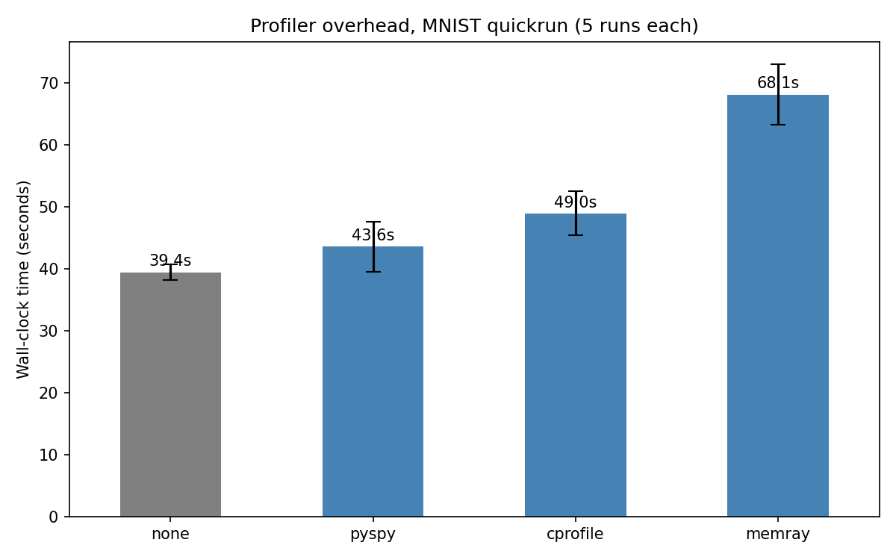

# Profiling Tools

Exploratory phase: discovering Python profilers, their metrics and
options, and the overhead each one adds.

## Setup

All trials ran on declearn's MNIST quickrun example
(`examples/mnist_quickrun/config.toml`, 2 rounds, 3 simulated clients).

## Tools considered

| tool                     | result   | reason                                                                                                     |
|--------------------------|----------|------------------------------------------------------------------------------------------------------------|
| cProfile                 | starter  | built-in, deterministic, works as a baseline. Heavy on call counts, no async/subprocess awareness          |
| line_profiler            | rejected | requires `@profile` decorators, no asyncio, no multi-process                                               |
| memory_profiler          | rejected | last commit on the GitHub repo dates back two years, project effectively unmaintained                      |
| yappi                    | kept (alt) | multi-thread and asyncio aware, drop-in pstats-compatible                                                |
| py-spy                   | **kept (CPU)** | sampling, asyncio-aware, `--subprocesses` follows children, low overhead, speedscope/flamegraph output |
| memray                   | **kept (memory)** | C-level allocation tracker, follows subprocesses, flamegraph + summary + stats views                |
| Tachyon (PEP 799)        | blocked  | promising but most declearn deps had no wheels for the alpha, cross-env profiling was impractical          |

## Overhead

Wall-clock cost of each kept profiler on the MNIST quickrun, five
interleaved runs per condition. Raw timings:
[data/overhead_results.csv](data/overhead_results.csv).

| condition | mean (s) | std (s) | overhead vs baseline |
|-----------|----------|---------|----------------------|
| baseline  | 39.44    | 1.27    | -                    |
| py-spy    | 43.62    | 4.04    | +10.6%               |
| cProfile  | 48.96    | 3.54    | +24.1%               |
| memray    | 68.14    | 4.87    | +72.7%               |

py-spy at 100 Hz was kept as the default sample rate.

## Why py-spy + memray

The pair covers what we need without overlapping:

- **py-spy** for CPU. Sampling profiler, configurable rate, follows
  subprocesses, asyncio-aware, exports to speedscope JSON for
  comparable cross-run views. Low enough overhead to keep on through
  bigger sweeps.
- **memray** for memory. Heavy, but the only way to get a faithful
  allocation flamegraph that follows declearn's subprocess fan-out.
  Run on demand, not by default.

cProfile stays useful as a deterministic sanity check (call counts,
exact `tottime`) when sampling is too coarse, but it is not the daily
driver.
